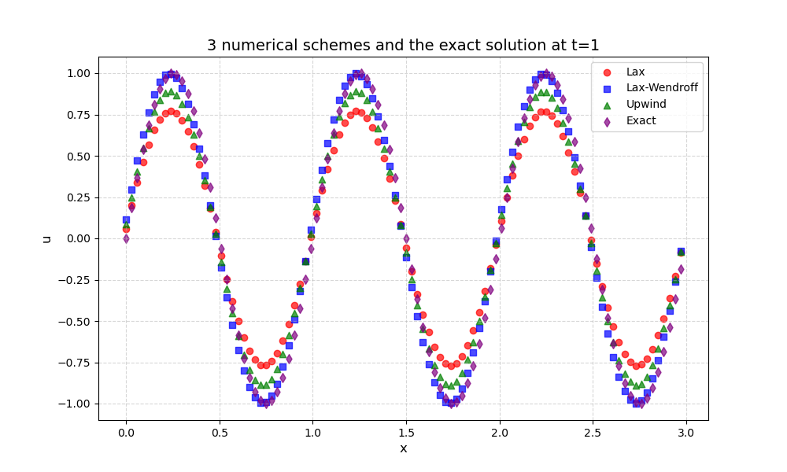
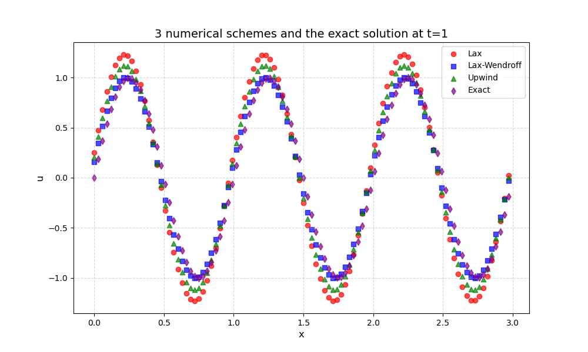

# 1.数理算法原理
下面给出Lax格式、Lax-Wendroff格式和一阶迎风格式的推导过程和相应的精度、稳定性、相位分析。

要求解的方程为：
$$\frac{\partial u}{\partial t}+\frac{\partial u}{\partial x}=0~~~~~~(1)$$

$(1)$ Lax格式
将$(1)$中的时间项做一阶向前差分，并将$u(x,t)$用$\frac{1}{2}(u(x-1,t)+u(x+1,t))$替换，空间项做中心差分，整理得到：
$$u(x,t+1)=\frac{1}{2}(1-c)u(x+1,t)+\frac{1}{2}(1+c)u(x-1,t)$$
时间项差分为一阶精度，空间项差分为二阶精度，因此该格式是二阶精度的
用Von Neumann方法分析稳定性，得到的放大因子为：
$$G=cosk\Delta x−icsink\Delta x$$
稳定性条件$|G|\leq1$推出$|c|\leq1$

$(2)$ Lax-Wendroff格式
将$u(x,t+1)$看作一元函数，对$u(x,t)$做泰勒展开：
$$u(x,t+1)=u(x,t)+\Delta t\frac{\partial u}{\partial t}+\frac{1}{2}\Delta t^2\frac{\partial ^2u}{\partial t^2}+O(\Delta t^3)$$
由$(1)$式，
$$\frac{\partial u}{\partial t}=-\frac{\partial u}{\partial x}~~~~~~(2.1)$$
上式两边分别对t x求导得到：
$$\frac{\partial ^2u}{\partial t^2}=-\frac{\partial ^2u}{\partial x\partial t}$$
$$\frac{\partial ^2u}{\partial x\partial t}=-\frac{\partial ^2u}{\partial x^2}$$
于是有：
$$\frac{\partial ^2u}{\partial t^2}=\frac{\partial ^2u}{\partial x^2}~~~~~~(2.2)$$
将$(2.1)~~(2.2)$两式带入泰勒展开式得到
$$u(x,t+1)=u(x,t)-\Delta t\frac{\partial u}{\partial x}+\frac{1}{2}\Delta t^2\frac{\partial ^2u}{\partial x^2}+O(\Delta t^3)$$
再对所有空间项用中心差分得到：
$$u(x,t+1)=u(x,t)-\frac{1}{2}c(u(x+1,t)-u(x-1,t))+\frac{1}{2}c^2(u(x+1,t)-2u(x,t)+u(x-1,t))$$
由于上面的中心差分是二阶精度的，因此该格式为二阶精度
用Von Neumann方法分析稳定性，得到的放大因子为：
$$G=1−c^2(1−cosk\Delta x)−icsink\Delta x~~~~~~(2.3)$$
稳定性条件为$|c|\leq1$
相位与准确解的相对相位之比为：
$$\frac{\Phi}{\Phi_{exact}}=\frac{Arg(G)}{-k\Delta xc}$$
从$(2.3)$可以得到G的辐角并与准确值比较：
$$Arg(G)=-arctan(\frac{csink\Delta x}{1−c^2(1−cosk\Delta x)})$$
当$|c|<1$时相位主要为落后，当$|c|>1$时相位主要为超前

$(3)$ 一阶迎风格式
将方程$(1)$的空间项改为一阶精度的向后差分，时间项改为一阶精度的向前差分：
$$\frac{u(x,t+1)-u(x,t)}{\Delta t}+\frac{u(x,t)-u(x-1,t)}{\Delta x}=0$$
移项得到：
$$u(x,t+1)=u(x,t)-c(u(x,t)-u(x-1,t))$$
空间和时间差分均为一阶，因此该格式为一阶精度
用Von Neumann方法分析稳定性，得到的放大因子为：
$$G=1−c(1−cosk\Delta x)−icsink\Delta x$$
稳定性条件为$|c|\leq1$

# 2.代码生成和调试
在./src/HW3.cpp中，输入网格数N，CFL数c和模拟时间T，可以得到以上三种格式和精确解在t=T时在给定区间上的解情况

# 3.结果讨论和解释
$(1)$ 精度
将三种格式的结果与精确值作差，并与步长（在本程序中为$\frac{3}{N}$）比较，可以发现Lax格式和Lax-Wendroff格式得到的误差大致与步长的平方成正比，而一阶迎风格式得到的误差大致与步长成线性关系，由此可以大致验证上面精度的推导。

$(2)$ 稳定性和相位
改变c=0.8和1.2，将结果绘图如下：

$$c=0.8$$

$$c=1.2$$
与精确解比较，可以发现与上面推导的稳定性条件对c的要求符合
观察极值点并与精确解比较，可以发现c=0.8时相位略微滞后，c=1.2时相位明显超前

## 附录1：AI工具使用声明表
|AI工具名称|生成代码|功能|
|:---------:|:------------:|:----:|
|Deepseek R1|第93-105行|将输出自动对齐，用于保证输出结果的可读性|

核心代码生成行数占比：100%

## 附录2：本次commit截图