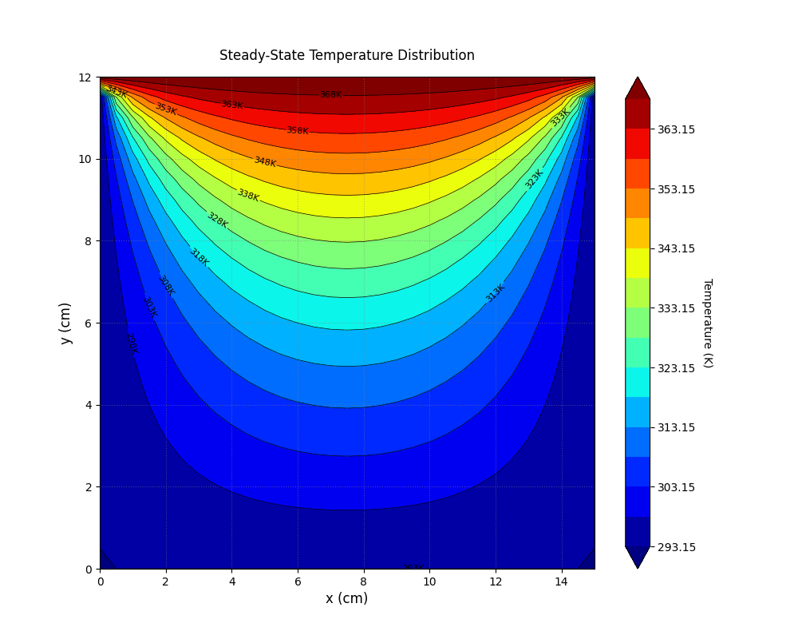
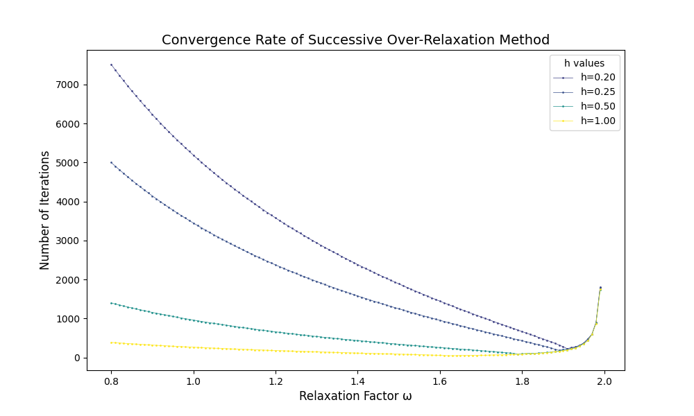

# 1.数理算法原理
流体的热传导方程：
$$\frac{\partial T}{\partial t}-\alpha\nabla^2T=0$$
最终达到稳态时$\frac{\partial T}{\partial t}=0$，因此在二维条件下原方程化为：
$$\frac{\partial^2T}{\partial^2x}+\frac{\partial^2T}{\partial^2y}=0$$
其中温度分布$T=T(x,y)$（温度单位：K，长度单位：cm）
边界条件为：
$$T(x,0)=T(0,y)=T(15,y)=293.15$$
$$T(x,12)=373.15$$
$$0\leq x\leq 15, 0\leq y\leq 12$$
要用迭代法求解以上方程，可以先用五点差分格式进行离散：
$$\frac{T(i+1,j)-2T(i,j)+T(i-1,j)}{\Delta x^2}+\frac{T(i,j+1)-2T(i,j)+T(i,j-1)}{\Delta y^2}=0$$
整理得：
$$T(i,j)=\frac{\Delta y^2(T(i+1,j)+T(i-1,j))+\Delta x^2(T(i,j+1)+T(i,j-1))}{2(\Delta x^2+\Delta y^2)}$$
假设采用均匀网格，即$\Delta x=\Delta y$,则上式写为：
$$T(i,j)=\frac{T(i+1,j)+T(i-1,j)+T(i,j+1)+T(i,j-1)}{4}$$
Gauss-Seidel迭代法为:
$$T^{k+1}(i,j)=\frac{T^k(i+1,j)+T^{k+1}(i-1,j)+T^k(i,j+1)+T^{k+1}(i,j-1)}{4}$$
松弛法要求：$T^{k+1}(i,j)=T^k(i,j)+\omega\Delta T$，这里$\omega$是松弛因子
下面计算$\Delta T$：
$$\Delta T=T^{k+1}(i,j)-T^k(i,j)=\frac{T^k(i+1,j)+T^{k+1}(i-1,j)+T^k(i,j+1)+T^{k+1}(i,j-1)}{4}-T^k(i,j)$$
带入原方程并整理得到：
$$T^{k+1}(i,j)=(1-\omega)T^k(i,j)+\frac{\omega}{4}[T^{k+1}(i-1,j)+T^{k+1}(i,j-1)+T^k(i+1,j)+T^k(i,j+1)]$$
这就是松弛法的迭代公式，终止条件为$max|T^{k+1}-T^k|<\epsilon$，下面取$\epsilon=10^{-5}$求解本问题。

# 2.代码生成与调试
用./src/HW4/TemperatureDistribution.cpp进行问题求解，可以自定义松弛因子和步长。同时为了观察收敛速率和松弛因子、步长的关系，可以在输入时开启测试循环，程序将相关数据自动写入相关文件，随后用同一文件夹下的Python程序可以进行画图。

# 3.结果讨论和物理解释
取松弛因子1.5，步长0.5，求解并画图得到稳态时的温度分布图象如下：

与物理常识相吻合，说明数值模拟成功。
下面为了比较收敛速率，对不同的松弛因子和步长分别求解，并画出总共迭代次数：

这里松弛因子从亚松驰的0.8一直取到超松弛法的2.0，可以从图中很明显看到收敛速率随着松弛因子的增大而先降后升，存在最佳松弛因子。并且最佳松弛因子会随着步长的增大而变小。

## 附录1：AI工具使用声明表
|AI工具名称|生成代码|功能|
|:---------:|:------------:|:----:|
|Deepseek R1|两个Python文件|将结果可视化|

核心代码生成行数占比：0%

## 附录2：本次commit截图
