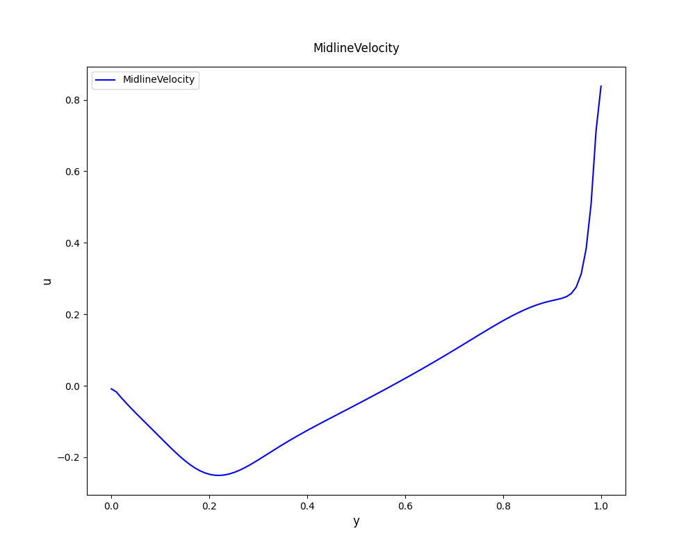
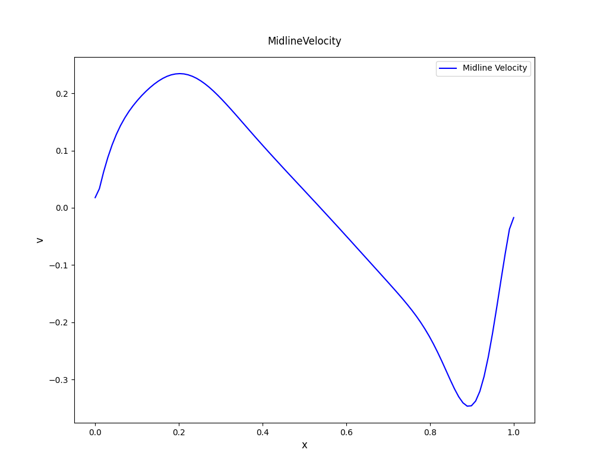

# 1.数理算法原理
顶盖驱动的方腔流动实际上就是要求解二维不可压缩流动：
$$
\begin{cases}
 \frac{\partial\omega}{\partial t}+(v \cdot\nabla)\omega=\nu\Delta\omega&(1.1)\\
 \Delta\psi=-\omega&(1.2)\\
 u=\frac{\partial\psi}{\partial y},~~~~~~v=-\frac{\partial\psi}{\partial x}\\
\end{cases}
$$
边界条件为$u(x,1)=sin^2(\pi x)$，其他边界为固壁。
下面对方程组分别进行离散。
对于式$(1.1)$，首先展开成以下形式：
$$\frac{\partial\omega}{\partial t}+\frac{\partial\psi}{\partial y}\frac{\partial\omega}{\partial x}-\frac{\partial\psi}{\partial x}\frac{\partial\omega}{\partial y}=\nu\Delta\omega$$
对空间导数做中心差分，并将Laplace算子离散为五点Laplace算子，时间导数做向前Euler差分：
$$\frac{\omega^{n+1}_{i,j}-\omega^{n}_{i,j}}{\Delta t}+\frac{\psi^{n}_{i,j+1}-\psi^{n}_{i,j-1}}{2h}\frac{\omega^{n}_{i+1,j}-\omega^{n}_{i-1,j}}{2h}-\frac{\psi^{n}_{i+1,j}-\psi^{n}_{i-1,j}}{2h}\frac{\omega^{n}_{i,j+1}-\omega^{n}_{i,j-1}}{2h}=\nu\frac{\omega^{n}_{i,j+1}+\omega^{n}_{i,j-1}+\omega^{n}_{i+1,j}+\omega^{n}_{i-1,j}-4\omega^{n}_{i,j}}{h^2}$$
从中可以导出内点的$\omega$迭代式：
$$\omega^{n+1}_{i,j}=\Delta t*(-(\frac{\psi^{n}_{i,j+1}-\psi^{n}_{i,j-1}}{2h})(\frac{\omega^{n}_{i+1,j}-\omega^{n}_{i-1,j}}{2h})+(\frac{\psi^{n}_{i+1,j}-\psi^{n}_{i-1,j}}{2h})(\frac{\omega^{n}_{i,j+1}-\omega^{n}_{i,j-1}}{2h})+\nu\frac{\omega^{n}_{i,j+1}+\omega^{n}_{i,j-1}+\omega^{n}_{i+1,j}+\omega^{n}_{i-1,j}-4\omega^{n}_{i,j}}{h^2}+\omega^{n}_{i,j})$$
对于式$(1.2)$，等价为解Poisson方程，可直接调用HW4中的SOR法进行求解。
对于边界上的涡量，一般形式的Thom公式为$\omega_0=-\frac{2(\psi_1-\psi_0+vh)}{h^2}$
带入得到边界条件：
$$\omega_{0,j}=\frac{2(\psi_{0,j}-\psi_{1,j})}{h^2}-\frac{2}{h}v_{0,j}$$
$$\omega_{n-1,j}=\frac{2(\psi_{n-1,j}-\psi_{n-2,j})}{h^2}+\frac{2}{h}v_{n-1,j}$$
$$\omega_{i,0}=\frac{2(\psi_{i,0}-\psi_{i,1})}{h^2}+\frac{2}{h}u_{i,0}$$
$$\omega_{i,m-1}=\frac{2(\psi_{i,m-1}-\psi_{i,m-2})}{h^2}-\frac{2}{h}u_{i,m-1}$$
最后，这里给出的初始条件是关于速度的，可以根据涡量的定义式$\omega=\frac{\partial v}{\partial x}-\frac{\partial u}{\partial y}$将给定的速度条件转化为涡量的初值。
于是得到算法的主要步骤如下：
1.从涡量定义式将给出的速度关系转化为初始涡量
2.调用SOR得到初始流函数
3.用Thom公式得到边界涡量
4.迭代内点涡量
5.调用SOR得到当前流函数
6.重复3 4 5
# 2.代码生成和调试
在代码中实现如下函数：
1.InitVelocity：用给定的速度进行初始化
2.InitVorticity：用速度对涡量进行初始化
3.SOR：通过超松弛迭代得到各点的流函数值，若得到迭代前后流函数值的最大改变量小于阈值，则认为收敛，特别的，若迭代次数为1次，即迭代1次就收敛，则我们认为流动达到稳定状态，可以结束整个程序。最后返回bool类型变量，用于判断是否结束整个程序。
4.UpdateVorticity：用流函数值更新内点的涡量
5.ApplyBoundCondition：用Thom公式更新边界的涡量
最终核心部分如下：

    InitVelocity(u, v, xsize, ysize);
    InitVorticity(u, v, omega, xsize, ysize, h);
    is_converge = SOR(psi, omega, xsize, ysize, h, relax_factor);

    while (is_converge)
    {
        ApplyBoundCondition(psi, omega, u, v, xsize, ysize, h);
        UpdateVorticity(omega, psi, h, nu, dt, xsize, ysize);
        is_converge = SOR(psi, omega, xsize, ysize, h, relax_factor);
    }

程序输入h，即指定格点的长度，得到结果为两个文件StreamFunction.txt和Vorticity.txt，文件每行三个数i j data，分别为离散化之后的格点坐标和对应的函数值。
接下来用Visualize.py对两个文件进行可视化，要注意python中画图的坐标系对二维数组来说是列优先而非行优先，因此在读入数据时需要反转坐标。
为了接下来比较涡心位置，在Visualize.py的locate_vortices函数中寻找流函数值的极小值，得到的结果就是主涡、次涡等涡心的位置和其流函数值。
# 3.结果讨论和物理解释
对于本问题，选取经典文献*High-Re Solutions for Incompressible Navier–Stokes Equations Using the Multigrid Method*中$Re=1000$，网格为$129*129$，从中心线速度剖面、主涡涡心位置与流函数值、二次涡与三次涡等简单角度与实验结果进行比较。
运行程序时，设定h=0.01，本次实验设定SOR收敛阈值$EPS=10^-6$，每次前进时间步$\Delta t=0.01$
## 3.1 中心线速度剖面
|实验结果|文献|
|-------|-------|
|  |  |
|  |  |

从图中可以看出，实验结果与文献吻合较好。在垂直中线剖面（x=0.5），出现了速度梯度突变，正好体现了边界层效应。进一步比对文献数据与实验结果，文献中u的极小值出现在y=23即约0.2处，数值为-0.38289，实验结果与其存在一定误差。再比较v的极值出现位置与数值，可以发现出现位置方面，文献与实验结果比较吻合，而数值则存在一定误差。原因可能在于设定参数的不同，这里得到的网格为100*100，且时间步、迭代阈值以及为了角点平滑性而对初速度进行的近似等设定均与文献结果存在一定差异，导致结果可能存在差异。出现差异的另一原因可能是本代码方法精度低于文献结果。文献中使用了较高精度的九点算子，而本实验时间项为一维向前差分，空间项为Laplace五点离散或者中心离散，精度不如文献方法。
## 3.2 主涡位置与流函数值
文献中主涡位置位于（0.5313，0.5625），对应流函数最小值为-0.117929，运行Visualize.py，输出显示主涡位置位于（0.54, 0.57），对应流函数最小值为-0.079079。二者位置相差较小，且均体现了主涡涡心位置的偏移。但对应数值存在一定差异，除了3.1中原因外，将数据存储后再用Python打开，二者之间可能存在截断误差。
## 3.3 二次涡与三次涡
|实验结果|文献|
|-------|-------|
|  |  |
|  |  |

二者图形大致相似。但文献中，等流函数线、等涡线的划分均为非均匀的，因此可以体现出数值极小的二次、三次涡。而受限于C++提供的浮点数精度，本实验得到数据并不能显示如此高的精度，且Python中设定等势线划分为非均匀会导致颜色映射不明显，因此图上不能体现出次涡。
但流速数值并没有达到如此小的量级，因此可以做出流线图进行比较。

从图中可以清晰看到二次涡与三次涡，以及次涡区域出现的典型的速度反转现象。

## 附录1：AI工具使用声明表
|AI工具名称|生成代码|功能|
|:---------:|:------------:|:----:|
|Deepseek R1|Visualize.py|对结果进行可视化|

核心代码生成行数占比：0%