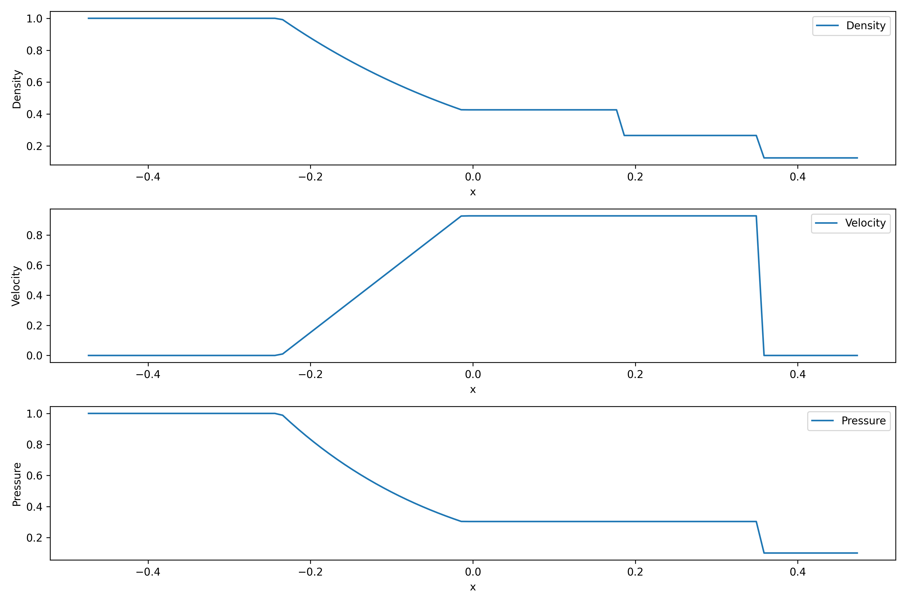
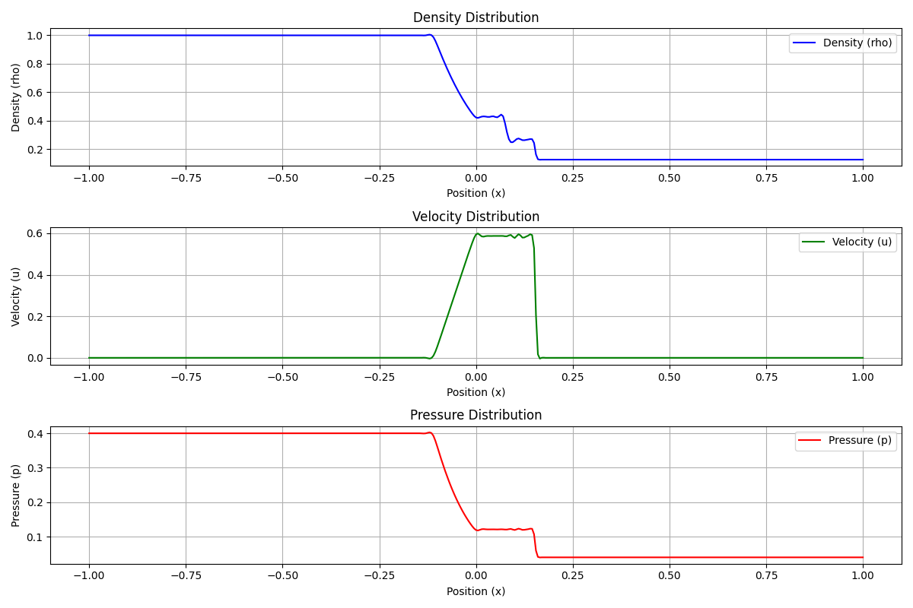

# 1.数理原理推导
对于一维的Sod激波管问题，实际上相当于求解一维的欧拉方程
$$\frac{\partial U}{\partial t}+\frac{\partial f}{\partial x}=0$$
初始条件为
$$\rho,u,p=1,0,1~~(x<0)$$
$$\rho,u,p=0.125,0,0.1~~(x>0)$$
## 1.精确解介绍
首先我们介绍求解Riemann精确解的方法及其结果。
从流体力学课上讲过的知识我们可以知道，激波管中可能出现三种波：激波、接触间断和膨胀波，其分别对应不同的边界条件。接下来，我们可以写出质量通量、动量通量和能量通量守恒的条件，并取控制体微元进行求解。这里查阅文档可知Sod激波管的实际演化为右边为激波，左边为膨胀波，因此我们可以得到方程如下：
左边膨胀波满足等熵条件：
$$\frac{p_{left}}{\rho_{left}^{\gamma}}=\frac{p}{\rho^{\gamma}}$$
$$u_{left}+\frac{2c_{left}}{\gamma -1}=u+\frac{2c}{\gamma -1}$$
右边激波满足Rankine-Hugoniot关系式：
$$\rho(u-Z)=\rho_{right}(u_{right}-Z)$$
$$\rho u(u-Z)+p=\rho_{right}u_{right}(u_{right}-Z)+p_{right}$$
$$E(u-Z)+up=E_{right}(u_{right}-Z)+u_{right}p_{right}$$
以上共5个方程5个未知数，因此可以用Newton迭代法解出。
在实际代码实现方面，我们选择用网上开源的Python程序进行求解，并保证代码结果有较高的可信度。
得到精确解的图形如下：

## 2.近似解求法
接下来，我们介绍求近似解的方法。
要求解一维欧拉方程，现有的技术一般分为流通矢量分裂(Flux
 Vector Splitting, FVS) 与流通差分分裂 (Flux Vector Splitting, FVS) 两种方法
### 1.流通矢量分裂（FVS）
方程的原始守恒变量U和流通矢量f(U)：
$$U=(\rho,\rho u,E)^T$$
记为$\omega_i$
则$$f(U)=(\omega_2,\frac{\omega_2^2}{\omega_1}+p,\frac{\omega_2}{\omega_1}(\omega_3+p))^T$$
再利用完全气体状态方程可以将f(U)做进一步的变形，于是可以得到Jacobi矩阵A：
$$A=\frac{\partial f}{\partial U}$$
$$A(U)=\begin{matrix}
    0 & 1 & 0 \\
    \frac{\gamma-3}{2}u^2 & (3-\gamma)u & \gamma-1\\
    -\frac{\gamma pu^2}{(\gamma-1)\rho}+\frac{\gamma-2}{2}u^3 & \frac{\gamma p}{(\gamma-1)\rho}-(\gamma-\frac{3}{2})u^2 & \gamma u
\end{matrix}$$
在引入了声速$c^2=\frac{\gamma p}{\rho}$的前提下，矩阵A的特征值和特征向量可解，其特征值为u-c,u,u+c
于是，要求的$\frac{\partial f}{\partial x}=\frac{\partial AU}{\partial x}=A\frac{\partial U}{\partial x}$，可以用特征值来求解。
下面我们对f(U)进行分裂：
$$\lambda = \lambda^++\lambda^-$$
则前向、后向的通量可求。
在本项目中，我们采用 Steger-Warming (S-W) 分裂法，其要求：
$$\lambda=\frac{\lambda+|\lambda|}{2}$$
于是我们可以将f化为$\lambda_i$的函数，也就得到了分裂后的流通矢量。
### 2.流通差分分裂（FDS）
流通差分分裂主要包括以下步骤：
1.用各种差分格式计算在格点i+1/2处的左右守恒通量
2.用近似解法计算每个格点i+1/2处的F
3.用差分法得到$\frac{\partial f}{\partial x}$
本项目中我们用Roe格式实现上述步骤。
上面我们已经推导了将f(U)转化成AU，进而用特征值进行计算来降低计算量的方法。这里我们对上面的步骤进行改造，对于非线性的Jacobi矩阵A，如果我们能够将其近似为线性的，那么也就化为求解方程$\frac{\partial U}{\partial t}+a\frac{\partial U}{\partial x}=0$，而这是我们所熟悉的方程。
注意到这里的a实际上是导数，因此我们可以用区间平均变化率来进行近似，且由Largrange中值定理，区间内必有这样的点（记为$u_{roe}$）使得其变化率满足要求。
于是近似的Riemann解为：
$$F=\frac{F(U_L)+F(U_R)}{2}-\frac{1}{2}S^{-1}|\Gamma|S(U_R-U_L)$$
这里$S^{-1}\Gamma S$为A的特征值分解。
由Roe公式，我们可以把A(U)写成A($\bar{U}$)，其中$\bar{U}$满足：
$$\bar{\rho}=(\frac{\sqrt{\rho_l}+\sqrt{\rho_r}}{2})^2$$
$$\bar{u}=\frac{\sqrt{\rho_l}u_l+\sqrt{\rho_r}u_r}{\sqrt{\rho_l}+\sqrt{\rho_r}}$$
$$\bar{H}=\frac{\sqrt{\rho_l}H_l+\sqrt{\rho_r}H_r}{\sqrt{\rho_l}+\sqrt{\rho_r}}$$
于是，我们就可以计算F
综上，Roe法的计算步骤如下：
1.用各种差分格式计算在格点i+1/2处的左右守恒通量U
2.用Roe平均计算$\bar{U}$
3.对得到的A进行特征值分解（参考我们在FVS中得到的结论）
4.计算每个格点i+1/2处的F
5.用差分法得到$\frac{\partial f}{\partial x}$
这里需要注意的是，Roe格式本质上是一种迎风格式，而迎风格式本身数值耗散可能会使得膨胀波等被耗散掉，而在特征值为0左右，耗散会变成0，因此我们需要在0处认为增加耗散，也就是熵修正。
这里进行的熵修正为：
$$\lambda=|\lambda|,~~~~~~|\lambda|>\epsilon$$
$$\lambda=\epsilon,~~~~~~|\lambda|<\epsilon$$
### 3.激波捕捉格式
在上面的步骤分析中，我们发现剩下的关键步骤是用差分格式进行激波捕捉，常用的方法有TVD格式，WENO格式和GVC格式。下面我们分别进行介绍。

1.TVD格式

本格式是对现有的差分进行改造，使得其总变差不增
也就是将格式构造为如下形式：
$$u^{n+1}_i=u^n_i+A(u^n_{i+1}-u^n_i)-B(u^n_i-u^n_{i-1})$$
一种TVD的构造格式是
$$u_{j+mid}=u_{j+mid}^l=u_j+\phi(r_j^l)\frac{u_{j+1}-u_j}{2}$$
$$u_{j-mid}=u_{j-mid}^r=u_j-\phi(r_j^r)\frac{u_{j}-u_{j-1}}{2}$$
这里$r_j=\frac{u_{j+1}-u_j}{u_j-u_{j-1}}$，$\phi(r_j^l)$为限制器，我们这里选择Van Leer限制器和MinMod限制器，其算法为：
$$\phi(r)=\frac{|r|+r}{|r|+1}~~~~~~(Van~Leer)$$
$$\phi(r)=max(0,min(1,r))~~~~~~(minmod)$$
该限制器均具有良好的光滑性。

2.WENO格式

WENO格式（加权本质无振荡方法）的基本思想是通过对多个插值区域进行加权平均，以提高数值通量的精度。具体要求通过为每个插值区域分配权重，确保实现更高的精度。
本项目中我们采用五点WENO格式，其计算公式如下（为了方便起见这里只列出正通量）：
$$IS_0 = \frac{13}{12} (f_{i-2} - 2f_{i-1} + f_i)^2 + \frac{1}{4} (f_{i-2} - 4f_{i-1} + 3f_i)^2$$
$$IS_1 = \frac{13}{12} (f_{i-1} - 2f_i + f_{i+1})^2 + \frac{1}{4} (f_{i-1} - f_{i+1})^2$$
$$IS_2 = \frac{13}{12} (f_i - 2f_{i+1} + f_{i+2})^2 + \frac{1}{4} (3f_i - 4f_{i+1} + f_{i+2})^2$$
$$\alpha_k=\frac{C_k}{(\epsilon+IS_k)^2}$$
$$\omega_k=\frac{\alpha_k}{\alpha_0+\alpha_1+\alpha_2}$$
$$f^{(0)}_{j+\frac{1}{2}} = \frac{1}{3}f_{j-2} - \frac{7}{6}f_{j-1} + \frac{11}{6}f_j$$
$$f^{(1)}_{j+\frac{1}{2}} = -\frac{1}{6}f_{j-1} + \frac{5}{6}f_j + \frac{1}{3}f_{j+1}$$
$$f^{(2)}_{j+\frac{1}{2}} = \frac{1}{3}f_j + \frac{5}{6}f_{j+1} - \frac{1}{6}f_{j+2}$$
$$f_{j+\frac{1}{2}}=\omega_0f^{(0)}_{j+\frac{1}{2}}+\omega_1f^{(1)}_{j+\frac{1}{2}}+\omega_2f^{(2)}_{j+\frac{1}{2}}$$
其中C0=0.1，C1=0.6,C2=0.3。于是我们可以构建差分：
$$\frac{\partial f_j}{\partial x}=\frac{f_{j+\frac{1}{2}}-f_{j-\frac{1}{2}}}{\Delta x}$$

3.GVC格式

GVC格式是为了解决激波附近的数值解因频散误差而出现非物理振荡而提出的，其原理为在在激波前使用慢格式（抑制超前扰动），激波后使用快格式（加速滞后扰动），从而达到抑制振荡的目的。
这里我们选用二阶迎风格式作为快格式，二阶中心差分格式作为慢格式。
如果我们构造限制器
$$\phi(r)=|r|,~~~~~~|r|>1$$
$$\phi(r)=1,~~~~~~|r|<1$$
就可以将GVC写成控制器的形式。这样只需要在原来代码的基础上修改控制器选择就可以了

### 4.时间推进
在有了以上的步骤后，我们最终的工作是求解形如：
$$\frac{\partial U}{\partial t}=Q(U)$$
的方程。以上方程已经被我们化简为常微分形式，因此我们可以采用计算常微分方程的Runge-Kutta法来进行计算。
本项目中我们选择3阶的Runge-Kutta方法，其公式如下：
$$U_1=U^n+\Delta tQ(U^n)$$
$$U_2=\frac{3}{4}U^n+\frac{1}{4}(U_1+\Delta tQ(U_1))$$
$$U^{n+1}=\frac{1}{3}U^n+\frac{2}{3}(U_2+\Delta tQ(U_2))$$

# 2.代码生成和调试
本项目形式比较分散，代码数量多而繁杂，因此我首先采取如下代码生成方法：
在主程序中仅保留初始化和结果输出等内容，将上面的核心内容分散到三个程序CalcDiff.cpp CalcFlux.cpp TimeIter.cpp中，这样代码的可读性和可维护性均得到较大提升。
用结构体存储原始变量和守恒量，这样结果和变量名均具有明显的意义。
最后，使用python程序SodVisualize.py对结果进行可视化。
在最后的实际实现中，可能由于不同方法的实现方式不同，为了使得其在极端值处表现正常所需要添加的参数不同，因此需要对不同的程序设置不同的参数，如为了避免除以一个小数，需要对数字加上一个eps，这个值在不同的方法下取值不同，且用结构体会导致代码需要重复写3遍，不如矩阵运算简便。且在调试时，对某一个函数进行重写可能导致其对其他方法得到更坏的结果。因此最终采取方案如下：对于每种激波捕捉方法和通量处理方法，分别生成一个主文件（共6个），包含所需要的全部函数。
主要函数的实现如下：
## 1.TVD
    double VanLeerLimiter(double r)
    {
        // Van Leer limiter
        return (r + abs(r)) / (1.0 + abs(r));
    }
    void CalcDiffTVD(const vector<Conserved>& U_left, const vector<Conserved>& U_right, vector<Conserved>& new_u_left, vector<Conserved>& new_u_right, vector<Conserved>& diff, double dx)
    {
        // Use TVD to calculate differences with Van Leer limiter
        int n = U_left.size();
        vector<Conserved> diff_left(n), diff_right(n);

        for (int i = 1; i < n - 2; ++i)
        {
            double r_left_rho = (U_left[i].rho - U_left[i - 1].rho) / (U_left[i + 1].rho - U_left[i].rho + eps);
            double r_left_rho_u = (U_left[i].rho_u - U_left[i - 1].rho_u) / (U_left[i + 1].rho_u - U_left[i].rho_u + eps);
            double r_left_E = (U_left[i].E - U_left[i - 1].E) / (U_left[i + 1].E - U_left[i].E + eps);
            double r_right_rho = (U_right[i + 2].rho - U_right[i + 1].rho) / (U_right[i + 1].rho - U_right[i].rho + eps);
            double r_right_rho_u = (U_right[i + 2].rho_u - U_right[i + 1].rho_u) / (U_right[i + 1].rho_u - U_right[i].rho_u + eps);
            double r_right_E = (U_right[i + 2].E - U_right[i + 1].E) / (U_right[i + 1].E - U_right[i].E + eps);

            // Apply Van Leer limiter
            double limiter_rho_left = VanLeerLimiter(r_left_rho);
            double limiter_rho_u_left = VanLeerLimiter(r_left_rho_u);
            double limiter_E_left = VanLeerLimiter(r_left_E);
            double limiter_rho_right = VanLeerLimiter(r_right_rho);
            double limiter_rho_u_right = VanLeerLimiter(r_right_rho_u);
            double limiter_E_right = VanLeerLimiter(r_right_E);

            new_u_left[i].rho = U_left[i].rho + 0.5 * (limiter_rho_left * (U_left[i + 1].rho - U_left[i].rho));
            new_u_left[i].rho_u = U_left[i].rho_u + 0.5 * (limiter_rho_u_left * (U_left[i + 1].rho_u - U_left[i].rho_u));
            new_u_left[i].E = U_left[i].E + 0.5 * (limiter_E_left * (U_left[i + 1].E - U_left[i].E));
            new_u_right[i].rho = U_right[i + 1].rho - 0.5 * (limiter_rho_right * (U_right[i + 1].rho - U_right[i].rho));
            new_u_right[i].rho_u = U_right[i + 1].rho_u - 0.5 * (limiter_rho_u_right * (U_right[i + 1].rho_u - U_right[i].rho_u));
            new_u_right[i].E = U_right[i + 1].E - 0.5 * (limiter_E_right * (U_right[i + 1].E - U_right[i].E));
        }

        for (int i = 2; i < n - 2; ++i)
        {
            diff[i].rho = (new_u_left[i].rho - new_u_left[i - 1].rho + new_u_right[i].rho - new_u_right[i - 1].rho) / dx;
            diff[i].rho_u = (new_u_left[i].rho_u - new_u_left[i - 1].rho_u + new_u_right[i].rho_u - new_u_right[i - 1].rho_u) / dx;
            diff[i].E = (new_u_left[i].E - new_u_left[i - 1].E + new_u_right[i].E - new_u_right[i - 1].E) / dx;
        }
    }
## 2.GVC
    double GVCLimiter(double r)
    {
        // GVC limiter
        return abs(r) > 1.0 ? 1.0 : r;
    }
    void CalcDiffGVC(const vector<Conserved>& U_left, const vector<Conserved>& U_right, vector<Conserved>& new_u_left, vector<Conserved>& new_u_right, vector<Conserved>& diff, double dx)
    {
        // Use TVD to calculate differences with Van Leer limiter
        int n = U_left.size();
        vector<Conserved> diff_left(n), diff_right(n);

        for (int i = 1; i < n - 2; ++i)
        {
            double r_left_rho = (U_left[i].rho - U_left[i - 1].rho) / (U_left[i + 1].rho - U_left[i].rho + eps);
            double r_left_rho_u = (U_left[i].rho_u - U_left[i - 1].rho_u) / (U_left[i + 1].rho_u - U_left[i].rho_u + eps);
            double r_left_E = (U_left[i].E - U_left[i - 1].E) / (U_left[i + 1].E - U_left[i].E + eps);
            double r_right_rho = (U_right[i + 2].rho - U_right[i + 1].rho) / (U_right[i + 1].rho - U_right[i].rho + eps);
            double r_right_rho_u = (U_right[i + 2].rho_u - U_right[i + 1].rho_u) / (U_right[i + 1].rho_u - U_right[i].rho_u + eps);
            double r_right_E = (U_right[i + 2].E - U_right[i + 1].E) / (U_right[i + 1].E - U_right[i].E + eps);

            // Apply GVC limiter
            double limiter_rho_left = GVCLimiter(r_left_rho);
            double limiter_rho_u_left = GVCLimiter(r_left_rho_u);
            double limiter_E_left = GVCLimiter(r_left_E);
            double limiter_rho_right = GVCLimiter(r_right_rho);
            double limiter_rho_u_right = GVCLimiter(r_right_rho_u);
            double limiter_E_right = GVCLimiter(r_right_E);

            new_u_left[i].rho = U_left[i].rho + 0.5 * (limiter_rho_left * (U_left[i + 1].rho - U_left[i].rho));
            new_u_left[i].rho_u = U_left[i].rho_u + 0.5 * (limiter_rho_u_left * (U_left[i + 1].rho_u - U_left[i].rho_u));
            new_u_left[i].E = U_left[i].E + 0.5 * (limiter_E_left * (U_left[i + 1].E - U_left[i].E));
            new_u_right[i].rho = U_right[i + 1].rho - 0.5 * (limiter_rho_right * (U_right[i + 1].rho - U_right[i].rho));
            new_u_right[i].rho_u = U_right[i + 1].rho_u - 0.5 * (limiter_rho_u_right * (U_right[i + 1].rho_u - U_right[i].rho_u));
            new_u_right[i].E = U_right[i + 1].E - 0.5 * (limiter_E_right * (U_right[i + 1].E - U_right[i].E));
        }

        for (int i = 2; i < n - 2; ++i)
        {
            diff[i].rho = (new_u_left[i].rho - new_u_left[i - 1].rho + new_u_right[i].rho - new_u_right[i - 1].rho) / dx;
            diff[i].rho_u = (new_u_left[i].rho_u - new_u_left[i - 1].rho_u + new_u_right[i].rho_u - new_u_right[i - 1].rho_u) / dx;
            diff[i].E = (new_u_left[i].E - new_u_left[i - 1].E + new_u_right[i].E - new_u_right[i - 1].E) / dx;
        }
    }
## 3.WENO
    void CalcWENO(const vector<double>& p, const vector<double>& u, const vector<Conserved>& U,
        vector<vector<double>>& F_left, vector<vector<double>>& F_right, vector<vector<double>>& diff_left, vector<vector<double>>& diff_right)
    {
        vector<vector<double>> lambda(3, vector<double>(N, 0.0));
        vector<vector<double>> lambda_left(3, vector<double>(N, 0.0));
        vector<vector<double>> lambda_right(3, vector<double>(N, 0.0));
        vector<double> C(N, 0.0);
        double eps = 1e-3;

        for (int i = 0; i < N; ++i)
        {
            C[i] = sqrt(abs(gamma_val * p[i] / U[i].rho));
            lambda[0][i] = u[i];
            lambda[1][i] = u[i] - C[i];
            lambda[2][i] = u[i] + C[i];
            for (int k = 0; k < 3; ++k)
            {
                lambda_left[k][i] = (abs(lambda[k][i]) + lambda[k][i]) / 2;
                lambda_right[k][i] = lambda[k][i] - lambda_left[k][i];
            }
        }

        for (int i = 0; i < N; ++i)
        {
            F_left[0][i] = U[i].rho / (2 * gamma_val) * (2 * (gamma_val - 1) * lambda_left[0][i] + lambda_left[1][i] + lambda_left[2][i]);
            F_left[1][i] = U[i].rho / (2 * gamma_val) * (2 * (gamma_val - 1) * lambda_left[0][i] * u[i] + lambda_left[1][i] * (u[i] - C[i]) + lambda_left[2][i] * (u[i] + C[i]));
            F_left[2][i] = U[i].rho / (2 * gamma_val) * ((gamma_val - 1) * lambda_left[0][i] * u[i] * u[i] + 0.5 * lambda_left[1][i] * (u[i] - C[i]) * (u[i] - C[i]) + 0.5 * lambda_left[2][i] * (u[i] + C[i]) * (u[i] + C[i]) + (3 - gamma_val) / (2 * gamma_val - 2) * (lambda_left[1][i] + lambda_left[2][i]) * C[i] * C[i]);

            F_right[0][i] = U[i].rho / (2 * gamma_val) * (2 * (gamma_val - 1) * lambda_right[0][i] + lambda_right[1][i] + lambda_right[2][i]);
            F_right[1][i] = U[i].rho / (2 * gamma_val) * (2 * (gamma_val - 1) * lambda_right[0][i] * u[i] + lambda_right[1][i] * (u[i] - C[i]) + lambda_right[2][i] * (u[i] + C[i]));
            F_right[2][i] = U[i].rho / (2 * gamma_val) * ((gamma_val - 1) * lambda_right[0][i] * u[i] * u[i] + 0.5 * lambda_right[1][i] * (u[i] - C[i]) * (u[i] - C[i]) + 0.5 * lambda_right[2][i] * (u[i] + C[i]) * (u[i] + C[i]) + (3 - gamma_val) / (2 * gamma_val - 2) * (lambda_right[1][i] + lambda_right[2][i]) * C[i] * C[i]);
        }

        for (int i = 0; i < N - 4; ++i)
        {
            double IS1_left = 0.0, IS2_left = 0.0, IS3_left = 0.0;
            double IS1_right = 0.0, IS2_right = 0.0, IS3_right = 0.0;

            for (int k = 0; k < 3; ++k)
            {
                IS1_left += 1.0 / 4.0 * pow(F_left[k][i] - 4 * F_left[k][i + 1] + 3 * F_left[k][i + 2], 2) + 13.0 / 12.0 * pow(F_left[k][i] - 2 * F_left[k][i + 1] + F_left[k][i + 2], 2);
                IS2_left += 1.0 / 4.0 * pow(F_left[k][i + 1] - F_left[k][i + 3], 2) + 13.0 / 12.0 * pow(F_left[k][i + 1] - 2 * F_left[k][i + 2] + F_left[k][i + 3], 2);
                IS3_left += 1.0 / 4.0 * pow(3 * F_left[k][i + 2] - 4 * F_left[k][i + 3] + F_left[k][i + 4], 2) + 13.0 / 12.0 * pow(F_left[k][i + 2] - 2 * F_left[k][i + 3] + F_left[k][i + 4], 2);

                IS1_right += 1.0 / 4.0 * pow(F_right[k][i + 4] - 4 * F_right[k][i + 3] + 3 * F_right[k][i + 2], 2) + 13.0 / 12.0 * pow(F_right[k][i + 4] - 2 * F_right[k][i + 3] + F_right[k][i + 2], 2);
                IS2_right += 1.0 / 4.0 * pow(F_right[k][i + 3] - F_right[k][i + 1], 2) + 13.0 / 12.0 * pow(F_right[k][i + 3] - 2 * F_right[k][i + 2] + F_right[k][i + 1], 2);
                IS3_right += 1.0 / 4.0 * pow(3 * F_right[k][i + 2] - 4 * F_right[k][i + 1] + F_right[k][i], 2) + 13.0 / 12.0 * pow(F_right[k][i + 2] - 2 * F_right[k][i + 1] + F_right[k][i], 2);
            }

            double omega1_left = 0.1 / pow(IS1_left + eps, 2) / (0.1 / pow(IS1_left + eps, 2) + 0.6 / pow(IS2_left + eps, 2) + 0.3 / pow(IS3_left + eps, 2));
            double omega2_left = 0.6 / pow(IS2_left + eps, 2) / (0.1 / pow(IS1_left + eps, 2) + 0.6 / pow(IS2_left + eps, 2) + 0.3 / pow(IS3_left + eps, 2));
            double omega3_left = 1 - omega1_left - omega2_left;

            double omega1_right = 0.1 / pow(IS1_right + eps, 2) / (0.1 / pow(IS1_right + eps, 2) + 0.6 / pow(IS2_right + eps, 2) + 0.3 / pow(IS3_right + eps, 2));
            double omega2_right = 0.6 / pow(IS2_right + eps, 2) / (0.1 / pow(IS1_right + eps, 2) + 0.6 / pow(IS2_right + eps, 2) + 0.3 / pow(IS3_right + eps, 2));
            double omega3_right = 1 - omega1_right - omega2_right;

            for (int k = 0; k < 3; ++k)
            {
                diff_left[k][i + 2] = omega1_left * (2 * F_left[k][i] / 6 - 7 * F_left[k][i + 1] / 6 + 11 * F_left[k][i + 2] / 6) +
                        omega2_left * (-F_left[k][i + 1] / 6 + 5 * F_left[k][i + 2] / 6 + 2 * F_left[k][i + 3] / 6) +
                        omega3_left * (2 * F_left[k][i + 2] / 6 + 5 * F_left[k][i + 3] / 6 - F_left[k][i + 4] / 6);

                diff_right[k][i + 2] = omega1_right * (2 * F_right[k][i + 4] / 6 - 7 * F_right[k][i + 3] / 6 + 11 * F_right[k][i + 2] / 6) +
                        omega2_right * (-F_right[k][i + 3] / 6 + 5 * F_right[k][i + 2] / 6 + 2 * F_right[k][i + 1] / 6) +
                        omega3_right * (2 * F_right[k][i + 2] / 6 + 5 * F_right[k][i + 1] / 6 - F_right[k][i] / 6);
            }
        }
    }
## 4.FDS
    Conserved flux_roe(const Conserved& UL, const Conserved& UR)
    {
        double rho_left = UL.rho, rho_right = UR.rho;
        double u_left = UL.rho_u / rho_left, u_right = UR.rho_u / rho_right;
        double p_left = (gamma_val - 1) * (UL.E - 0.5 * rho_left * u_left * u_left);
        double p_right = (gamma_val - 1) * (UR.E - 0.5 * rho_right * u_right * u_right);

        double H_left = (gamma_val / (gamma_val - 1)) * p_left / rho_left + 0.5 * u_left * u_left;
        double H_right = (gamma_val / (gamma_val - 1)) * p_right / rho_right + 0.5 * u_right * u_right;

        double sqrt_rho_left = sqrt(rho_left), sqrt_rho_right = sqrt(rho_right);
        double u_roe = (sqrt_rho_left * u_left + sqrt_rho_right * u_right) / (sqrt_rho_left + sqrt_rho_right);
        double H_roe = (sqrt_rho_left * H_left + sqrt_rho_right * H_right) / (sqrt_rho_left + sqrt_rho_right);
        double c_roe = sqrt((gamma_val - 1) * (H_roe - 0.5 * u_roe * u_roe));

        double lambda1 = u_roe - c_roe;
        double lambda2 = u_roe;
        double lambda3 = u_roe + c_roe;

        double eps = 1e-6;
        lambda1 = (abs(lambda1) < eps) ? (lambda1 * lambda1 + eps * eps) / (2 * eps) : lambda1;
        lambda3 = (abs(lambda3) < eps) ? (lambda3 * lambda3 + eps * eps) / (2 * eps) : lambda3;

        double drho = UR.rho - UL.rho;
        double drho_u = UR.rho_u - UL.rho_u;
        double dE = UR.E - UL.E;

        Conserved flux;
        flux.rho = 0.5 * (UL.rho * u_left + UR.rho * u_right) - 0.5 * (abs(lambda1) * drho);
        flux.rho_u = 0.5 * (UL.rho_u * u_left + UR.rho_u * u_right + p_left + p_right) - 0.5 * (abs(lambda2) * drho_u);
        flux.E = 0.5 * (u_left * (UL.E + p_left) + u_right * (UR.E + p_right)) - 0.5 * (abs(lambda3) * dE);

        return flux;
    }
## 5.FVS
    void CalcFluxFVS(const vector<Conserved>& U, vector<Conserved>& F_left, vector<Conserved>& F_right)
    {
        // Use Steger-Warming flux vector splitting
        int n = U.size();
        // Initialize eigenvalues and output
        vector<double> lambda(3), lambda_left(3), lambda_right(3);
        for (int i = 0; i < n; ++i)
        {
            F_left[i] = {0.0, 0.0, 0.0};
            F_right[i] = {0.0, 0.0, 0.0};
        }

        for (int i = 0; i < n; ++i)
        {
            State state = ConservedToState(U[i]);
            double rho = state.rho;
            double u = state.u;
            double T = (gamma_val - 1.0) * (U[i].E / rho - 0.5 * u * u) / R_val;
            double p = rho * R_val * T;
            double c = sqrt(gamma_val * p / rho);
            double local_eps = 1e-3;

            lambda[0] = u;
            lambda[1] = u - c;
            lambda[2] = u + c;

            for (int j = 0; j < 3; ++j)
            {
                lambda_left[j] = (lambda[j] + sqrt(lambda[j] * lambda[j] + local_eps * local_eps)) / 2.0;
                lambda_right[j] = (lambda[j] - sqrt(lambda[j] * lambda[j] + local_eps * local_eps)) / 2.0;
            }

            double omega_left = ((3 - gamma_val) * (lambda_left[1] + lambda_left[2]) * c * c) / (2.0 * (gamma_val - 1.0));
            F_left[i].rho = (rho / (2 * gamma_val)) * ((2 * (gamma_val - 1) * lambda_left[0]) + lambda_left[1] + lambda_left[2]);
            F_left[i].rho_u = (rho / (2 * gamma_val)) * ((2 * (gamma_val - 1) * lambda_left[0] * u) + lambda_left[1] * (u - c) + lambda_left[2] * (u + c));
            F_left[i].E = (rho / (2 * gamma_val)) * ((gamma_val - 1) * lambda_left[0] * u * u + 0.5 * lambda_left[1] * (u - c) * (u - c) + 0.5 * lambda_left[2] * (u + c) * (u + c) + omega_left);

            double omega_right = ((3 - gamma_val) * (lambda_right[1] + lambda_right[2]) * c * c) / (2.0 * (gamma_val - 1.0));
            F_right[i].rho = (rho / (2 * gamma_val)) * ((2 * (gamma_val - 1) * lambda_right[0]) + lambda_right[1] + lambda_right[2]);
            F_right[i].rho_u = (rho / (2 * gamma_val)) * ((2 * (gamma_val - 1) * lambda_right[0] * u) + lambda_right[1] * (u - c) + lambda_right[2] * (u + c));
            F_right[i].E = (rho / (2 * gamma_val)) * ((gamma_val - 1) * lambda_right[0] * u * u + 0.5 * lambda_right[1] * (u - c) * (u - c) + 0.5 * lambda_right[2] * (u + c) * (u + c) + omega_right);
        }
    }
## 6.3阶Runge-Kutta
    void RungeKutta3(vector<Conserved>& U, double dt, double dx)
    {
        int n = U.size();
        vector<Conserved> U0 = U;
        vector<Conserved> U1(n), U2(n);
        vector<Conserved> f_left(n), f_right(n), diff(n), temp_left(n), temp_right(n);
        for (int i = 0; i < n; ++i)
        {
            f_left[i] = {0.0, 0.0, 0.0};
            f_right[i] = {0.0, 0.0, 0.0};
            diff[i] = {0.0, 0.0, 0.0};
        }

        CalcFluxFVS(U, f_left, f_right);
        CalcDiffTVD(f_left, f_right, temp_left, temp_right, diff, dx);
        for (int i = 0; i < n; ++i)
        {
            U1[i].rho = U0[i].rho - dt * diff[i].rho;
            U1[i].rho_u = U0[i].rho_u - dt * diff[i].rho_u;
            U1[i].E = U0[i].E - dt * diff[i].E;
        }

        for (int i = 0; i < n; ++i)
        {
            f_left[i] = {0.0, 0.0, 0.0};
            f_right[i] = {0.0, 0.0, 0.0};
            diff[i] = {0.0, 0.0, 0.0};
        }

        CalcFluxFVS(U1, f_left, f_right);
        CalcDiffTVD(f_left, f_right, temp_left, temp_right, diff, dx);
        for (int i = 0; i < n; ++i)
        {
            U2[i].rho = 0.75 * U0[i].rho + 0.25 * (U1[i].rho - dt * diff[i].rho);
            U2[i].rho_u = 0.75 * U0[i].rho_u + 0.25 * (U1[i].rho_u - dt * diff[i].rho_u);
            U2[i].E = 0.75 * U0[i].E + 0.25 * (U1[i].E - dt * diff[i].E);
        }

        for (int i = 0; i < n; ++i)
        {
            f_left[i] = {0.0, 0.0, 0.0};
            f_right[i] = {0.0, 0.0, 0.0};
            diff[i] = {0.0, 0.0, 0.0};
        }

        CalcFluxFVS(U2, f_left, f_right);
        CalcDiffTVD(f_left, f_right, temp_left, temp_right, diff, dx);
        for (int i = 0; i < n; ++i)
        {
            U[i].rho = (1.0/3.0) * U0[i].rho + (2.0/3.0) * (U2[i].rho - dt * diff[i].rho);
            U[i].rho_u = (1.0/3.0) * U0[i].rho_u + (2.0/3.0) * (U2[i].rho_u - dt * diff[i].rho_u);
            U[i].E = (1.0/3.0) * U0[i].E + (2.0/3.0) * (U2[i].E - dt * diff[i].E);
        }
    }
主要函数仅举以上几例，具体实现方法在代码文件中有完整体现。
直接打开6个文件并运行即可得到存储在SodResult.txt中的数据，再运行SodVisualize.py即可得到解的图像。
# 3.结果讨论和解释
最终画图如下：
FDS-TVD:

FDS-WENO:

FDS-GVC:

FVS-TVD:

FVS-WENO:

FVS-GVC:

精确解：

## 1.网格格点划分和时间步长的讨论
通过改变格点的大小，观察发现解与网格大小无关。这里仅举一例：
对FVS-TVD方法，改变格点使得其为200 500，得到解图像分别如下：
N=200：

N=500：

可以发现解图像与网格大小是无关的。因此为了计算效率，这里我们选择网格N=200
对于时间步长，为了收敛其必须满足关系：$dt=cfl * dx / max(u+c)$，这里c为声速。
同时查阅文献可知，Sod激波演化一般到t=0.14-0.2秒内即可表现出典型形态，因此这里我们将其设为t=0.14，注意利用cfl数得到的dt并不一定能被t整除，因此在current_time + dt > t即下一步会超出设定时间时，我们要令dt = t - current_time
## 2.与精确解比较
与精确解比较可以有如下发现：
1.整体上实现函数对精确解的拟合较好
2.总体来看，使用FDS的方法对激波的捕捉都没有FVS方法精确，可能有以下原因：
FVS方法引入了固有耗散，可以抑制非物理振荡，而这里使用的FDS方法可能在近似时引入了较大的误差，或者熵修正时进行的近似并不完备。同时，这里普遍采用了网格点在N=200时进行实验，FDS格式在粗格点下捕捉间断的能力弱。只有到了高密度的网格下，WENO格式才能展现高精度的一面。我们在FDS中选择的限制器与FDS耦合不理想也可能是其无法敏锐捕捉激波的原因。
3.从激波捕捉格式来看，最精确的为WENO格式，其次为TVD格式，这与5点WENO的高精度和TVD格式限制器的选择有关。
4.时间效率上来说，FVS方法要显著快于FDS方法。这是因为FDS方法需要求解矩阵的特征值和特征向量，即使事先导出矩阵的特征值和特征向量，在求解过程中也要进行矩阵乘法或类似的操作，而FVS方法可以直接从式子中导出标量，计算量小。
## 3.其他
在进行求解的时候，遇到了以下问题，这说明要编制好程序不仅需要对物理方程的熟悉，还需要对计算机和各种机器语言的结构有一定了解。
1.在进行计算的时候，常常遇到可能除以一个小值，由此导致数值超出范围，解决方法是在分母上添加一个小值$\epsilon$，在本程序中，常取0.000001
2.在进行差分运算时，由于要用到周围点，因此边界点的处理是十分重要的。一种解决方案是将越界点的权值置为0，但这样可能丢失重要信息。因此这里我们采用了插入“幽灵”节点的方法，也就是使得越界点合法化，这样进行运算只需要注意下标是否越界即可。

## 附录1：AI工具使用声明表
|AI工具名称|生成代码|功能|
|:---------:|:------------:|:----:|
|Deepseek R1|SodVisualize.py|对结果进行可视化|
|GitHub Copilot|ExactSolver.py中的部分代码|求Sod问题的精确解，并解答为什么计算时会出现值为NaN|

核心代码生成行数占比：0%
## 附录2：本次commit截图
